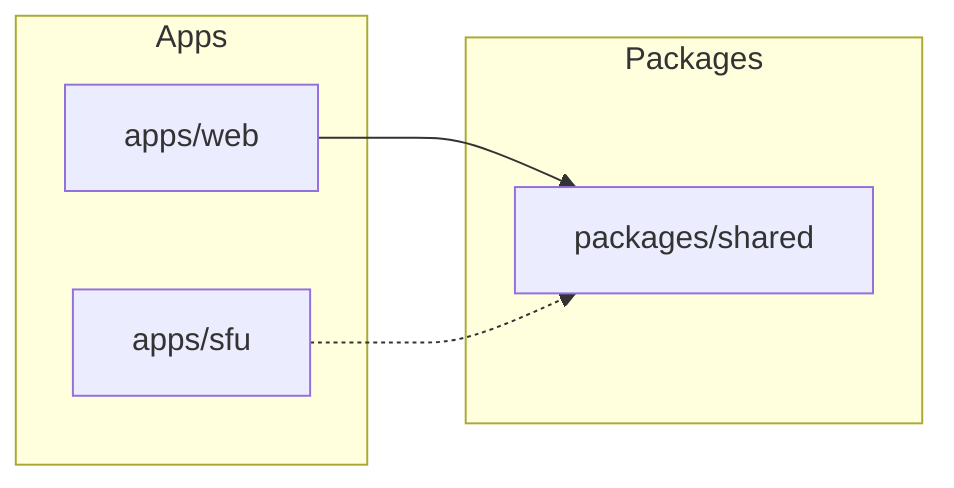

# Architecture

Single source of truth for style guides and architecture standards. All future plans and implementations should align with this file.

---

## 1. Tech stack

- **Frontend**: TanStack Start (Vite + React 19), TanStack Router, Tailwind CSS v4.
- **Backend**: Colocated server logic only (no separate API app). Server functions via `createServerFn` from `@tanstack/react-start`, run on same process as frontend.
- **Data**: PostgreSQL, Drizzle ORM. Schema and migrations live in `apps/web` (Drizzle config and `src/db/`).
- **Validation**: Zod; shared schemas in `packages/shared` (e.g. `@sideform/shared/schemas`).
- **Auth**: Cookie-based session (HTTP-only, sameSite lax). Password hashing: argon2id.

## 2. Monorepo layout

- `apps/web` – main web app (TanStack Start, routes, server fns, DB access).
- `apps/sfu` – future mediasoup/SFU (separate service).
- `packages/shared` – shared TypeScript types and Zod schemas; consumed by `apps/web` (and future API/SFU as needed).
- `infra` – IaC (e.g. CDK). No app logic.

## 3. Web app structure (`apps/web/src/`)

- `db/` – Drizzle schema (`schema.ts`), `getDb()` and re-exports (`index.ts`). No business logic.
- `server/` – server functions only. One file per domain (e.g. `auth.ts`, `meetingTypes.ts`). Each fn uses `createServerFn({ method }).handler(...)`. **Keep server functions in dedicated `.ts` files**; do not define `createServerFn` in the same file as route/component code. This keeps a clear boundary so Vite does not bundle server-only deps (DB, cookies, Node built-ins) into the client.
- `routes/` – file-based routing. `routeTree.gen.ts` is generated; do not edit.
- `styles/` – global CSS (e.g. `app.css`); Tailwind applied via root.

## 4. Auth and session

- Session cookie name and shape are internal to `server/auth.ts`. Server code that needs the current user must use a single entry point: **requireUserId()** (async, returns `Promise<string>`). It reads the session and returns `userId` or throws `redirect({ to: "/login" })`. Call with `await requireUserId()` inside server fn handlers.
- Session helpers (`getSession`, `setSession`) and handlers use **dynamic imports** for `@tanstack/react-start/server` (getCookie, setCookie, deleteCookie) and for `@/db` so those modules are not statically pulled into the client bundle.
- All authenticated server functions must call this helper first and scope queries/mutations by `user_id`.
- Protected UI lives under `routes/_authenticated/`. Layout uses `beforeLoad` to call `getCurrentUserFn()` and redirect unauthenticated users to `/login`; child routes receive `user` via `Route.useRouteContext()`.

## 5. Server functions

- **Location**: `apps/web/src/server/<domain>.ts`.
- **Naming**: `<action><Resource>Fn` (e.g. `listMeetingTypesFn`, `createMeetingTypeFn`, `getMeetingTypeFn`, `updateMeetingTypeFn`, `deleteMeetingTypeFn`).
- **HTTP methods (TanStack Start constraint)**: The framework’s server handler accepts only **GET** and **POST**. Use **GET** for idempotent reads (payload is serialized to the query string). Use **POST** for all mutations (create, update, delete). Do not use PUT or DELETE—they cause the server to throw "expected POST method".
- **Client call shape**: The client always sends the payload under a `data` property. Examples: `getMeetingTypeFn({ data: { meetingTypeId } })`, `createMeetingTypeFn({ data: payload })`, `updateMeetingTypeFn({ data: { meetingTypeId, data: payload } })`, `deleteMeetingTypeFn({ data: { meetingTypeId } })`. The framework serializes GET payloads to the query string and POST payloads to the JSON body.
- **Handler signature**: Handlers receive a single argument **`ctx`** (server context). The decoded payload is in **`ctx.data`**, not at the top level. Do not destructure the first argument as the payload (e.g. `async ({ meetingTypeId }) => ...`); that reads `ctx.meetingTypeId`, which is undefined. Read from `ctx.data` instead (e.g. `(ctx.data as { meetingTypeId?: string })?.meetingTypeId` or, for GET, also handle `(ctx.data as { data?: { meetingTypeId?: string } })?.data?.meetingTypeId` depending on how the server decodes the query). For POST create/update, `ctx.data` is typically the decoded body (e.g. `{ meetingTypeId, data }` for update).
- **Input validation**: Use shared Zod schemas where applicable. For POST handlers, validate `ctx.data` (or the inner payload) with `schema.safeParse()` and return `{ error: string }` on failure. Accept identifiers (e.g. `meetingTypeId`) from `ctx.data`.
- **Authorization**: Call `await requireUserId()` at the start of any fn that mutates or returns user-scoped data. Filter all DB reads/writes by `user_id` (or ownership derived from it).
- **Return**: Return plain objects or `null`; for errors return `{ error: string }` or throw. Do not log plaintext of sensitive data (notes, chat, etc.).
- **Server-only imports and bundling**: Do not use static top-level imports of server-only modules in files that are imported by routes/components. That includes `@tanstack/react-start/server` (getCookie, setCookie, deleteCookie), `@/db` (getDb, schema tables), and `./auth` (requireUserId). Use **dynamic imports inside the handler** instead: `const { getCookie } = await import("@tanstack/react-start/server")`, `const { getDb, users } = await import("@/db")`, `const { requireUserId } = await import("./auth")`. This prevents Vite from bundling server-only code into the client and avoids "Failed to resolve import" errors for TanStack Start virtual modules.
- **Execution**: Loaders and server function calls are isomorphic. When a route loader runs on the client (e.g. after navigation), calling a server function triggers an HTTP request (GET with payload in query, POST with JSON body); cookies are sent. When the loader runs on the server (SSR), the server function may run in-process with the request context. Handlers must therefore rely only on `ctx` and server-side APIs (cookies, DB) that receive the current request context.

## 6. Routing

- **Convention**: File-based under `routes/`. Dynamic segments: `$paramName` (e.g. `$meetingTypeId`, `$meetingId`). Params in components: `Route.useParams()`.
- **Layouts**: `_authenticated.tsx` wraps all authenticated routes and provides nav + `Outlet`. Public routes (e.g. `/login`, `/signup`, `/join/$meetingId`) sit outside it.
- **Data loading**: Use a route **loader** to fetch data; do not fetch the same data in the component with `useEffect`. The loader receives `{ params }` (and optionally `context`); call server functions from the loader with the correct **`{ data: ... }`** shape (see §5). Return the result from the loader; the component reads it via **`Route.useLoaderData()`**. For "not found" (e.g. server function returns `null`), throw **`redirect({ to: "/somewhere" })`** in the loader so the router performs the redirect before rendering. Optionally set **`pendingComponent`** to show a loading UI while the loader runs.
- **Loader vs beforeLoad**: `beforeLoad` runs sequentially from parent to child and merges its return into route context (e.g. auth user). Loaders run in parallel after all `beforeLoad`; loader data is per-route and not merged into context. Use `beforeLoad` for guards and shared context; use `loader` for route-specific data.

## 7. Validation and shared schemas

- **Ownership**: `packages/shared` owns request/response shapes and Zod schemas for API boundaries (e.g. `createMeetingTypeBodySchema`, `updateMeetingTypeBodySchema`). Export types via `z.infer<typeof schema>`.
- **Usage**: Web app imports from `@sideform/shared/schemas` (or `@sideform/shared`). Server fns validate incoming payloads with these schemas before DB access.

## 8. Styling

- **Tailwind**: Utility-first. Prefer existing palette (zinc for neutrals, e.g. `bg-zinc-50`, `text-zinc-900`, `border-zinc-200`).
- **Components**: No formal component library yet. Use semantic HTML and consistent class patterns: primary actions `bg-zinc-900 text-white hover:bg-zinc-800`, secondary `border border-zinc-300 rounded-md hover:bg-zinc-100`, form inputs `border border-zinc-300 rounded-md`, error text `text-red-600`.
- **Layout**: Use flex/grid as needed; keep spacing consistent (e.g. `mb-4`, `space-y-4`, `p-4`).
- **Forms**: Buttons that are not the form submit must have `type="button"`. For add/remove or other non-submit actions inside a form, use `onClick={(e) => { e.preventDefault(); e.stopPropagation(); doAction(); }}` so the form does not submit or capture the click.

## 9. Database

- **Schema**: All tables and relations in `apps/web/src/db/schema.ts`. Use Drizzle relations for type-safe nested queries where helpful.
- **Access**: Only via `getDb()` from `@/db`. No direct `pg` usage outside `db/index.ts`.
- **Migrations**: Drizzle Kit; migrations in `apps/web/drizzle/`. Generate with `pnpm db:generate`, apply with `pnpm db:migrate` (or `db:push` for dev).
- **Scoping**: All user-owned data must be filtered by `user_id` (or equivalent) using the current user from session.

## 10. Security (MVP baseline)

- **Auth**: HTTP-only secure cookies; CSRF considerations for cookie-based auth (per INITIAL_PLAN).
- **Data**: Never log plaintext notes, chat, or file contents. Log only IDs and operational metadata.
- **Authorization**: Server-side only. Every mutation and user-scoped read must verify ownership via `requireUserId()` and `user_id` checks.

## 11. References

- Product and data-model spec: `INITIAL_PLAN.md`.
- API surface (meeting types, meetings, auth, etc.): described in INITIAL_PLAN; implement via server functions in `apps/web` rather than a separate REST API.
